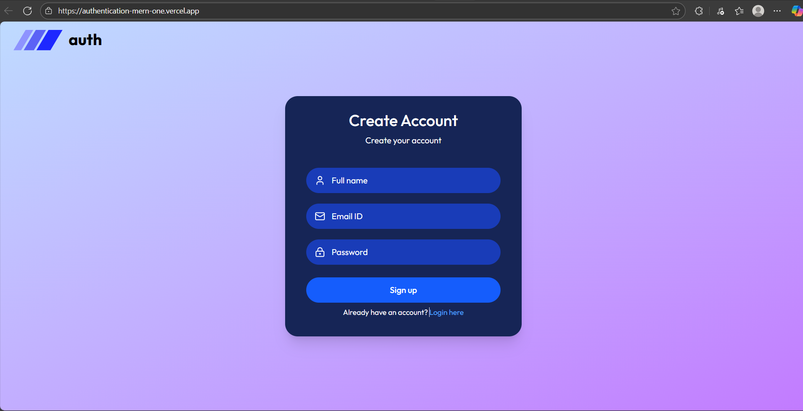
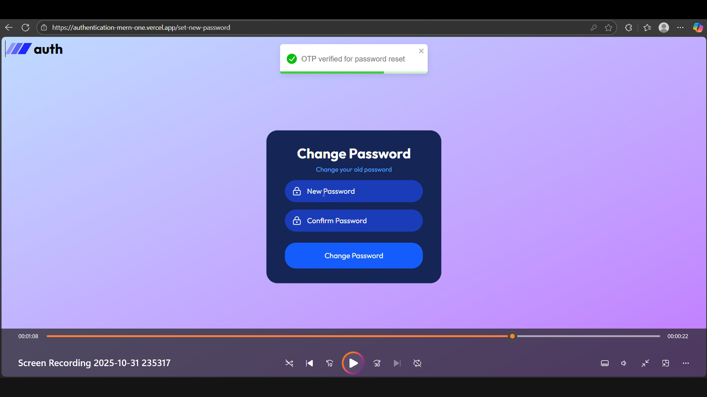
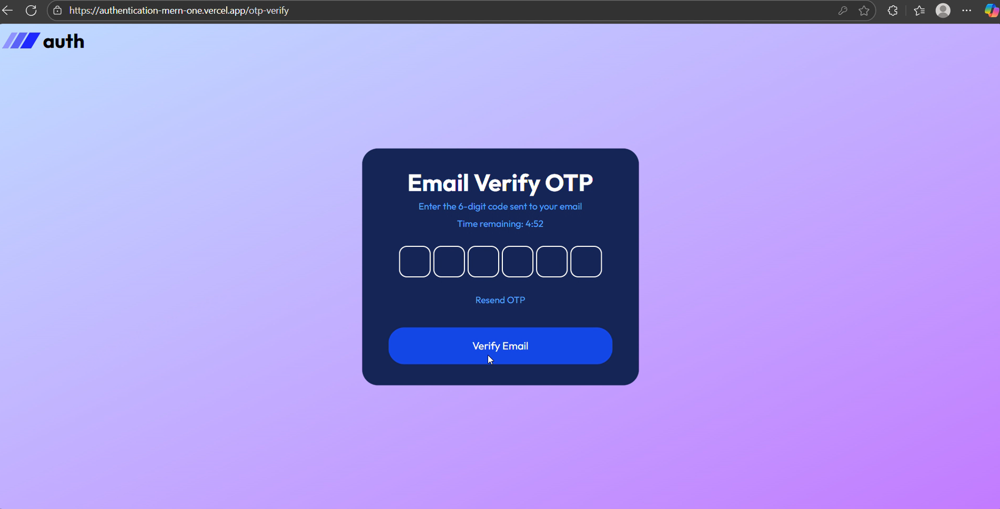
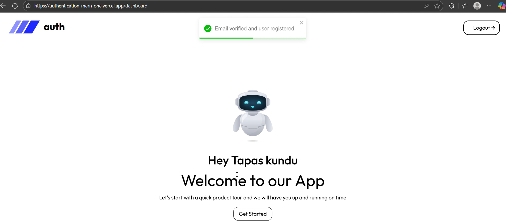

# MERN Auth Pro – Full-Stack JWT Authentication

A **secure, production-ready** authentication system built with the **MERN stack** (MongoDB, Express, React, Node.js). Features **JWT-based login**, **email verification**, **forgot password with OTP**, **secure dashboard**, and **email delivery via Brevo (formerly Sendinblue)**.

Live Demo: [https://authentication-mern-one.vercel.app](https://authentication-mern-one.vercel.app)  

Key concepts implemented:
- **Email-based OTP signup flow** (valid for 5 minutes)
- **Email verification** for registered users
- **Forgot-password** with OTP and reset token
- **Secure JWT-based authentication**
- **Cookie & Bearer-token support**
- **Transactional emails via Brevo API**

---

## Features

| Feature | Description | Preview |
|----------|--------------|----------|
| 📝 **Signup with OTP** | Registers user and sends a 6-digit OTP via email. |  |
| 🔐 **Login with JWT** | User login with token stored in httpOnly cookie. |  |
| 🔄 **Forgot Password** | Generates OTP and allows secure password reset. |  |
| ✉️ **Email Verification** | Validates user email using Brevo transactional mail. |  |
| 💼 **Dashboard** | Displays username and profile info after login. |  |

---

## Tech stack
- **Frontend:** React.js (Next.js / Vite compatible)
- **Backend:** Node.js + Express
- **Database:** MongoDB (Mongoose)
- **Auth:** JWT + Cookies
- **Email Service:** Brevo API (`@getbrevo/brevo`)
- **Env Management:** dotenv
